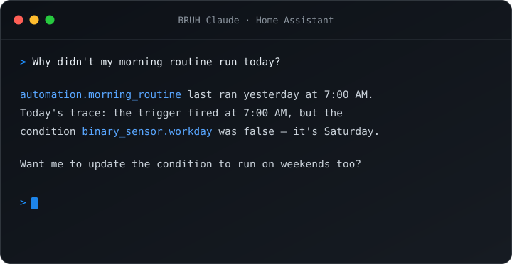

# BRUH Terminal

Claude Code for Home Assistant: a full terminal with native HA API access, a fast voice assistant, scheduled AI insight reports, and deep HA integration.

📖 **Documentation:** [Quick Start](https://bruhautomation.com/bruh-claude/quickstart/) · [Configuration Reference](https://bruhautomation.com/bruh-claude/reference/) · [Changelog](https://bruhautomation.com/bruh-claude/changelog/) — or the in-repo [DOCS.md](DOCS.md) / [CHANGELOG.md](CHANGELOG.md)

## Features

### Voice Assistant (Assist)
Claude as a conversation agent in Settings > Voice Assistants:
- **Fast**: pre-warmed worker pool answers typical commands in ~3–5s, and replies stream so TTS starts speaking at the first sentence (on streaming-capable pipelines)
- **Area-aware**: "turn off the kitchen lights" acts directly — no entity lookups
- **Conversation memory**: follow-ups resume the same Claude session
- **Multiple personalities**: each agent gets its own name, model, and system prompt
- **Safe by default**: voice can control everything but can't run shell commands or edit files (`assist_tool_access: mcp_only`)

### Insight Jobs (scheduled Claude reports)
Claude watches your house and writes markdown reports to sensors — daily briefing, anomaly watch, battery & maintenance, camera check, or your own prompt (HA templating supported). Schedule by interval/daily time or trigger via `bruh_claude.run_insight`; each sensor includes ready-to-paste dashboard card YAML.

### Native HA API Access (MCP Server)
33 tools give Claude real-time access to your installation:
- Entity states, service calls, device control for every major domain
- **Camera vision** — Claude can look at a camera and describe what it sees
- **History, statistics & forecasts** — "how cold did it get last night?", "what's the weather tomorrow?"
- Areas/rooms, automation traces, logs, Jinja2 templates, config reloads
- **Power Tools** — 36 registry-management services (`bruh_claude.*`): create/rename areas, floors, labels and zones, rename entities and devices, enable/disable/hide entities, reload integrations, flag repair issues — all validated and admin-gated, no `.storage` hand-edits (adapted from [Spook](https://github.com/frenck/spook), MIT)

### Terminal & Workflow
- **Auto-generated context**: `CLAUDE.md` describing your install, regenerated each startup
- **Git-based config backup**: periodic auto-commits of `/config`, manual `ha-backup`, easy restore
- **CLI tools**: `ha-reload`, `ha-log`, `ha-entity`, `ha-service`, `ha-yaml-check`, `ha-selftest`, and more
- **Persistent environment**: APK/pip packages survive restarts (`persist-install`)
- **Multi-session**: tmux windows, background tasks, mobile-friendly UI with toolbar

### Home Assistant Integration
- **Automation tasks**: `bruh_claude.run_task` runs Claude jobs from automations (optional model override + completion notification/event)
- **Usage limit sensors**: your real Anthropic session/weekly utilization and reset times (the same numbers as claude.ai > Settings > Usage; requires OAuth/subscription login)
- **Health sensor**: `binary_sensor … Assist healthy` with worker and latency attributes

## Requirements

- **Home Assistant OS or Supervised** — the add-on system needs the Supervisor
- A **64-bit host**: `amd64` or `aarch64` (Pi 4/5, x86 NUC, or similar). 32-bit boards (Pi 3 and earlier) aren't supported
- **~1 GB free RAM** beyond HA itself — fast voice keeps up to 3 pre-warmed workers (~150–300 MB each); tunable or off
- An **Anthropic account** — a **Claude Pro/Max** subscription is most economical (OAuth-based), or an API key

## Installation

1. Add this repository to your Home Assistant add-on store
2. Install "BRUH Terminal" and start it
3. **Restart Home Assistant** (Settings > System > Restart) — required on first install so HA loads the BRUH Claude integration
4. Accept the discovered BRUH Claude integration (Settings > Devices & Services)
5. Authenticate with your Anthropic account in the terminal
6. **After every add-on upgrade, restart HA again** when prompted (persistent notification + repair) so the updated integration code loads

## Configuration

See [DOCS.md — Configuration Reference](DOCS.md#configuration-reference) for every option. The defaults work out of the box; the ones most worth knowing:

| Option | Default | Description |
|--------|---------|-------------|
| `assist_fast_mode` | `true` | Pre-warmed Claude workers for fast voice (~150–300 MB RAM per warm worker, max 3) |
| `assist_tool_access` | `mcp_only` | Voice gets all HA tools but no shell/file/web access (`full` to lift) |
| `assist_max_turns` / `automation_max_turns` | `5` / `10` | Agentic turn caps per request |
| `auto_backup` / `backup_interval_minutes` | `true` / `30` | Git config backup |
| `auto_generate_context` | `true` | Regenerate `CLAUDE.md` on startup |
| `dangerously_skip_permissions` | `false` | Terminal-only: skip per-action confirmation ([details](DOCS.md#permissions)) |
| `access_share` / `access_media` / `access_backup` / `access_addon_configs` / `access_addons` | `true` | Volume exposure toggles |
| `additional_directories`, `persistent_apk_packages`, `persistent_pip_packages` | `[]` | Extra dirs / persistent packages |
| `log_level` | `info` | Add-on log verbosity |

## Support

- **Something not working?** Run `ha-selftest` in the terminal first — it drives the whole stack end-to-end and prints PASS/FAIL with a fix hint for each part.
- **Found a bug or have a request?** Open an issue at [github.com/bruhautomation/BRUH-HA-Apps](https://github.com/bruhautomation/BRUH-HA-Apps/issues). Set `log_level: debug` and include the relevant log output.

## Credits

Based on the excellent [Claude Terminal](https://github.com/heytcass/home-assistant-addons) by Tom Cassady.

## Disclaimer

This is an independent project, **not affiliated with, endorsed by, or sponsored by Anthropic**. "Claude" and "Claude Code" are trademarks of Anthropic, PBC. The add-on runs the official Claude Code CLI under your own Anthropic account; your use of Claude through it is governed by [Anthropic's terms](https://www.anthropic.com/legal/consumer-terms).
